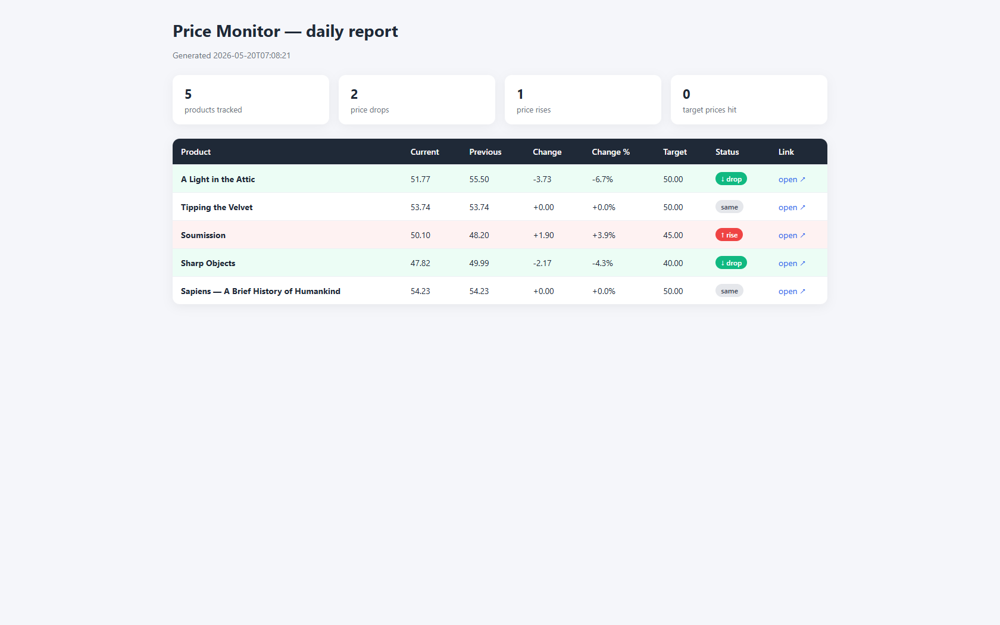

# Price Monitor

A small Python tool that tracks product prices across e-commerce stores,
keeps a full history, and generates an Excel workbook + an HTML report
on every run. Designed to be configured by editing one YAML file, and
extended to any store that allows scraping.



> **Portfolio demo** — this is a sample project showcasing automation
> work (web scraping, data pipelines, reporting). Production use should
> always respect each site's `robots.txt` and terms of service.

## What it does

1. Reads a list of products from `products.yaml` (URL + CSS selector + optional target price).
2. Fetches each page and extracts the current price.
3. Appends the result to `history.csv` so you build a full price timeline.
4. Compares to the previous run and flags **drops**, **rises** and **target hits**.
5. Writes `report.xlsx` (color-coded Excel) and `report.html` (shareable web report).
6. With `--notify`, prints a Slack/Discord-ready summary of notable changes.

## Quick start

```bash
pip install -r requirements.txt
python price_monitor.py
```

Open `report.html` in a browser, or `report.xlsx` in Excel.

To get a chat-ready notification of drops & target hits:

```bash
python price_monitor.py --notify
```

## Adding your own products

Edit `products.yaml`:

```yaml
products:
  - name: My Product
    url: https://example-store.com/product/123
    selector: ".product-price"
    target_price: 99.99
```

`selector` is any CSS selector that matches the price element on the page.
You can find it in the browser DevTools (right-click the price → Inspect).

## Schedule it

To run every morning, add to crontab (Linux/macOS):

```cron
0 8 * * * cd /path/to/price-monitor && /usr/bin/python3 price_monitor.py --notify
```

Or Windows Task Scheduler — same idea, daily 8:00 AM.

## Project layout

```text
price-monitor/
├── price_monitor.py    # main script
├── products.yaml       # the list of products to watch
├── requirements.txt    # Python dependencies
├── history.csv         # generated on first run, grows over time
├── report.xlsx         # generated on every run
└── report.html         # generated on every run
```

## Possible extensions

- Send the summary to Slack/Discord/email instead of printing.
- Plot price history as a chart (matplotlib).
- Run from a cloud VM and host `report.html` on a static URL.
- Add JS-rendered store support via Playwright when a site needs JavaScript.
